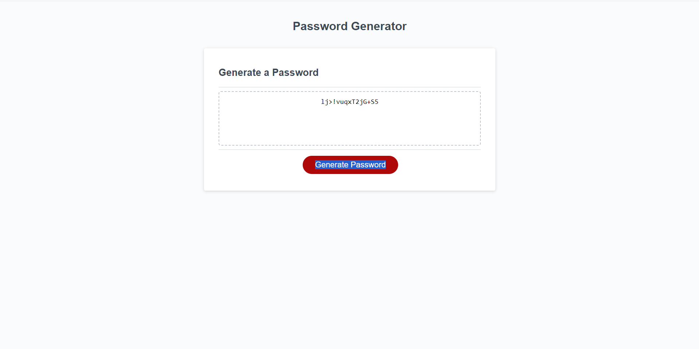

# password-generator

## Description

The goal of this project was to create a random password generator. With the password generator, the user is asked to choose a number between 8-128, and then answer yes or no to the following questions...

1. Do you want lower case letters in your password?
2. Do you want upper case letters in your password?
3. Do you want numbers in your password?
4. Do you want symbols in your password?

A random password will then be generated based on the options you chose.

## Installation

You can either visit the website to use the password generator, or download it to your computer and open the index from there.

## Credits

UTA-VIRT-FSF-FT-06-2023-U-LOLC Repo in GitLab.

https://math.stackexchange.com/questions/2335330/probability-of-getting-all-four-answers-right-with-true-and-false-in-each-quest

https://github.com/coding-boot-camp/friendly-parakeet

## License

MIT License

---